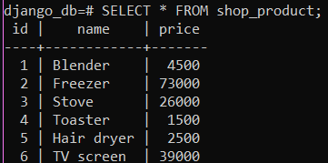
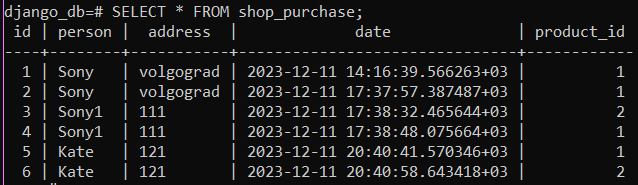
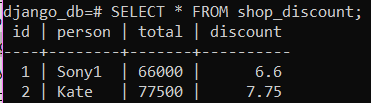
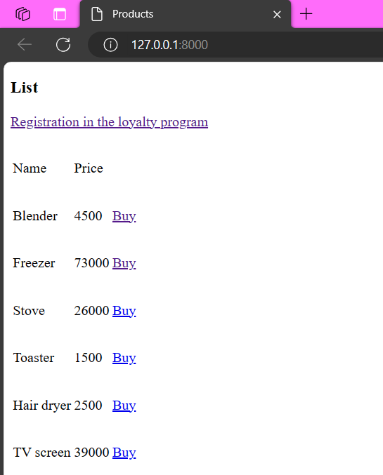
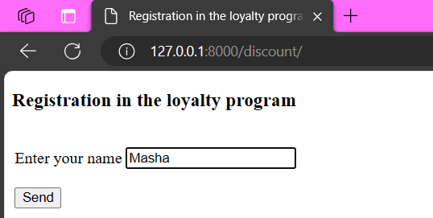
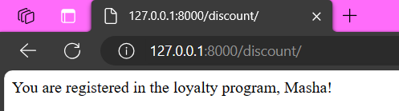
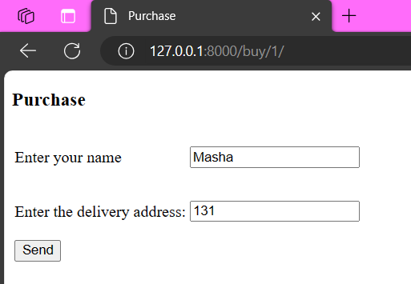
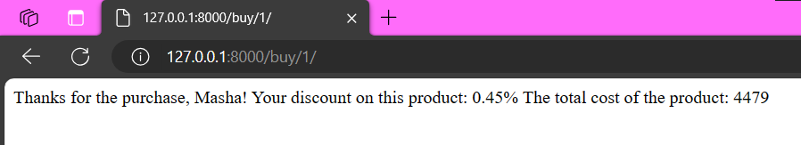
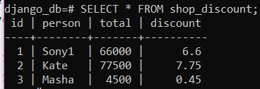
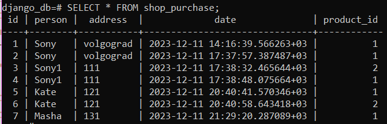

# Лабораторная 2 и 3 по дисциплине Технологии программирования
### Цели работы  
1. Познакомиться c моделью MVC, ее сущностью и основными фреймворками на ее основе.  
2. Разобраться с сущностями «модель», «контроллер», «представление», их функциональным
назначением.  
3. Получить навыки разработки веб-приложений с использованием MVC-фреймворков, написания
модульных тестов к ним.

В работе используется учебный проект, представляющий собой простейший пример интернетмагазина, реализованного с использованием модели MVC с помощью фреймворка Django на языке
Python.  

### Вариант 7  
Магазин бытовой техники. Магазин должен вести учет покупателей и делать накопительную скидку. Величина скидки зависит от общей суммы покупок любых товаров.  

#### Технологии  
- pyCharm 2021.2.2  
- python 3.8  
- django  
- psycopg2  
- dj-database-url  
- gunicorn  
- whitenoise  
- django-heroku  
- pytz  
- sqlparse  
- pyyaml  

## Экранные формы:  

### Таблицы БД  
Ассортимент магазина:  
  

Покупки:  
  

Участники программы лояльности:  
  

### Страница приложения  
Начальная страница:  
  

Окно регистрации в программе лояльности:  
  

Успешная регистрация в программе лояльности:  
  

Покупка техники:  
  

Сообщение о действующей скидке и итоговой сумме покупки:  
  

### Обновленные таблицы БД  
Покупки:  
  

Участники программы лояльности:  
  

### Выводы:  
Я познакомилась c моделью MVC, ее сущностью и основными фреймворками на ее основе  получила нвыки разработки веб-приложений с использованием MVC-фреймворков, написания
модульных тестов к ним.  
